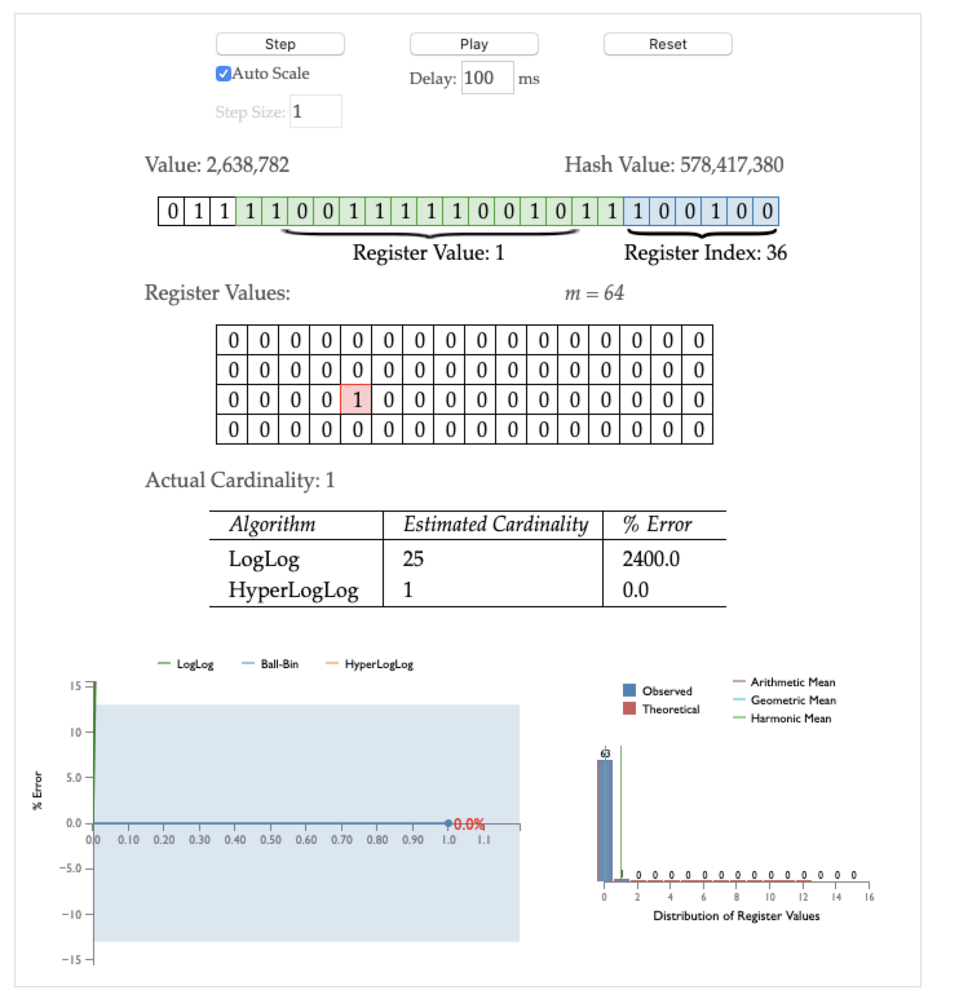
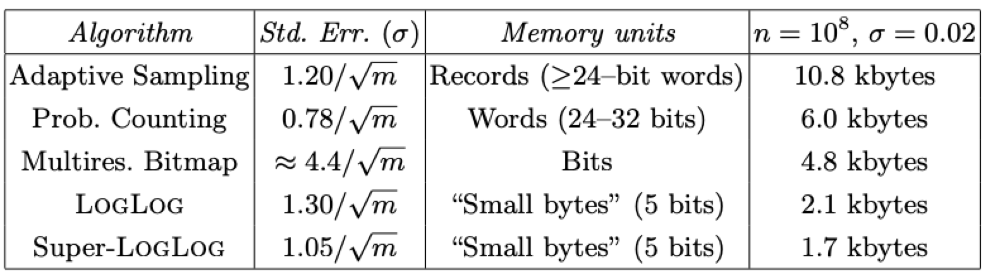

# redis-hyperloglog算法
相关文件
- hyperloglog.c

hyperloglog是用来做基数统计的算法，此算法的优点为，即使输入元素数量或者体积非常大时，计算基数只需要很小的固定大小的内存空间。

但hyperloglog仅能提供不精确的去重统计。

redis中每个hyperloglog键只需要12KB内存，就可以计算2^64个不同的基数。但是hyperloglog只会根据输入来计算基数，并不会存储原始数据。

基数即为一个集合去重之后的元素数量，例如{1,2,3,1,4,2,5,3}，去重之后得到集合{1,2,3,4,5}，长度为5，因此基数为5。

hyperloglog算法特点：
- 实现复杂
- 是用很少的内存统计巨量数据，例如redis中12KB->2^64个数据
- 存在误差，误差率整体不高。标准差为0.81%
- 误差可以通过设置辅助计算因子进行降低

redis中使用16384个6位register实现，每一个key一共使用12kb内存

## 数据结构

redis中HLL的头部结构
```c
/*
 * +------+---+-----+----------+
 * | HYLL | E | N/U | Cardin.  |
 * +------+---+-----+----------+
 */

#define HLL_DENSE 0 /* Dense encoding. */
#define HLL_SPARSE 1 /* Sparse encoding. */

struct hllhdr {
    char magic[4];      // 字符HYLL
    uint8_t encoding;   // 编码方式 HLL_DENSE or HLL_SPARSE.
    uint8_t notused[3]; // 暂时没用，0
    uint8_t card[8];    // 小端存储的基数
    uint8_t registers[]; // 字节数据，小端存储
};
```
如果最高字节的最高有效位置为1，说明数据被修改了，不能直接用，需要重新计算。

redis中密集编码结构如下

```c
 * +--------+--------+--------+------//      //--+
 * |11000000|22221111|33333322|55444444 ....     |
 * +--------+--------+--------+------//      //--+
 ```
6位的计数器编码为从最低有效位到最高有效位一次排列，必要情况下使用下一个字节。

稀疏编码结构使用游程编码方式，结合三个操作码ZERO，XZERO，VAL，其中XZERO占两个字节，其他的占一个字节。

    注：游程编码(run-length encoding,RLE)也就是变动长度编码，与数据性质无关的无损压缩基数，基于使用变动长度的码来取代连续重复出现的原始数据。例如，数据"AAAABBBCCDEEEE"，由4个A、3个B、2个C、1个D、4个E组成，经过RLE将数据压缩为4A3B2C1D4E（由14个单位转成10个单位）。其优点在于将重复性高的数据量压缩成小单位；其缺点在于─若该数据出现频率不高，可能导致压缩结果数据量比原始数据大，例如：原始数据"ABCDE"，压缩结果为"1A1B1C1D1E"（由5个单位转成10个单位）。

ZERO操作码：表示方式为'00xxxxxx'。后面6位的x表示N个register(也就是分组)，从1开始，最多表示连续1-64个register的value全部为0。

XZERO操作码：两字节，格式'01xxxxxx yyyyyyyy'，后面14位，其中x表示最高有效位y表示最低有效位，表示从从0-16384的连续register置为0。

VAL操作码：一个字节，格式'1vvvvvxx'。中间五位v表示register中的值，后面xx表示连续多少个register置为v(这不就是RLE么)。value从1-32重复次数1-4次。

    注：sparse表示方式，不能存储大于32的值，虽然大于32的情况下sparse方式内存利用率更高，但是仍会转为dense方式。

空的HLL用sparse方式表示为ZXERO:16384。

例子：一个HLL只有三个非空register，位置为1000，1020，1021；分别存储2，3，3，三种操作码对应为。
- XZERO:1000 标记register0-999为0
- VAL:2,1 一个register的value置为2，对应的register为1000(上面+1)
- ZERO:19 register 1001-1019置为0
- VAL:3,2 两个register的value置为3，分别是1020，1021
- XZERO:15362 1022-16383 连续153362个register置为0

上面例子中sparse编码格式，只用了7个字节，而不是12K来表示HLL的register。对于小的基数空间利用率非常高，处理起来也更快。


dense编码，需要12288字节，所以在基数处于2000-3000时，sparse编码方式有巨大的优势。基数更大，虽然节省了空间但是处理也会更慢，具体由sparse编码转换为dense编码的阈值由server.hll_sparse_max_bytes定义。

## 算法原理
这个算法是完全的概率学上的算法，基于伯努利过程。

基于抛硬币问题，每次正面向上的概率为1/2，一直抛硬币，直到出现正面，抛的次数为k；n次实验中，出现n个k，最大值为k<sub>max</sub>，因此有一下结论
- n次伯努利过程中投掷次数都不大于k<sub>max</sub>
- 至少有一次为k<sub>max</sub>

第一条结论：n次实验次数都不大于k<sub>max</sub>的概率为

P<sub>n</sub>(X<=k<sub>max</sub>)=(1-1/2<sup>k<sub>max</sub></sup>)<sup>n</sup>

第二条结论：至少有一次等于k<sub>max</sub>概率为

P<sub>n</sub>(X>=k<sub>max</sub>)=1-(1-1/2<sup>k<sub>max</sub>-1</sup>)<sup>n</sup>

由公式可以看出来，当n远小于2<sup>k<sub>max</sub></sup>时第二个式子趋向于0，也就意味着违反了第二条结论。

当n远大于2<sup>k<sub>max</sub></sup>时，第一个式子趋近于0，违反了第一条结论。

因此为满足上述两条结论，我可以用2<sup>k<sub>max</sub></sup>来估计n的大小。

n=2<sup>k<sub>max</sub></sup>

结论总结为：进行n次实验，记录下所有的次数k，根据最大的次数k<sub>max</sub>来估计实验组数n。

## 改进

上面的实验发现如果实验仅进行一轮，偶然性过大。因此考虑重复实验取平均值来进行估计，这就是LogLog算法。

对所有的k<sub>max</sub>求平均得到平均值R

n=constant\*m\*2<sup>R</sup>

其中constant为修正因子(用来减少误差)，m为重复实验的组数，R为k<sub>max</sub>的算数平均值。

但是很明显算数平均值对异常大的数据比较敏感(想想平均工资，富豪们拉上去的)。
因此引入调和平均数。

H=1/(1/m\*sum(1/k<sub>max</sub>))=m/(sum(1/k<sub>max</sub>))

因此我们估计时采用调和平均数来抵抗异常数据影响。

## redis中咋用的

例如使用HLL统计某页面访问次数。

对于每一个用户key进行hash，得到一个64位的hash。

因为redis中设置的m即桶的个数(重复实验的组数)为16384，因此hash中低14位为桶的索引。

来张图

链接在[这里](http://content.research.neustar.biz/blog/hll.html)

找到了对应组的位置接下来就把这个hash串剩下的位作为一次伯努利实验，从低到高第一个1出现的位置，记为当前实验的k<sub>max</sub>，然后转换为2进制放到6位的register中去。如果两个key映射在同一个桶中，则替换为更大的k<sub>max</sub>(相当于当前组的实验中出现了更大的值)。在这里面呢，每一次尝试去更新value就相当于抛了一次硬币，统计访问次数，就相当于我们要统计抛硬币的次数。

## 偏差修正

之前也说了，这个统计是个估计值，不是准确值，所以是存在误差的。“[Loglog Counting of Large Cardinalities](http://algo.inria.fr/flajolet/Publications/DuFl03-LNCS.pdf)“这里分析了误差。

上面的公式中有一个constant变量来做误差修正。



可以看出m越大误差越小，但是用的空间也越大。

作者给出了一种分阶段修正算法。当HLL开始统计数据时，这时HLL中大部分为0，因此引入一种小范围修正方法；当HLL已满时，需要统计的基数很大，hash会有很多碰撞，此时引入大范围修正方法。

```python
m = 2^b   # with b in [4...16]

if m == 16:
    alpha = 0.673
elif m == 32:
    alpha = 0.697
elif m == 64:
    alpha = 0.709
else:
    alpha = 0.7213/(1 + 1.079/m)

registers = [0]*m   # initialize m registers to 0

###########################################################################
# Construct the HLL structure
for h in hashed(data):
    register_index = 1 + get_register_index( h,b ) # binary address of the rightmost b bits
    run_length = run_of_zeros( h,b ) # length of the run of zeroes starting at bit b+1
    registers[ register_index ] = max( registers[ register_index ], run_length )

##########################################################################
# Determine the cardinality
DV_est = alpha * m^2 * 1/sum( 2^ -register )  # the DV estimate

if DV_est < 5/2 * m: # small range correction
    V = count_of_zero_registers( registers ) # the number of registers equal to zero
    if V == 0:  # if none of the registers are empty, use the HLL estimate
          DV = DV_est
    else:
          DV = m * log(m/V)  # i.e. balls and bins correction

if DV_est <= ( 1/30 * 2^32 ):  # intermediate range, no correction
     DV = DV_est
if DV_est > ( 1/30 * 2^32 ):  # large range correction
     DV = -2^32 * log( 1 - DV_est/2^32)
```

在redis的实现中，误差定义在这里
```c
#define HLL_ALPHA_INF 0.721347520444481703680 /* constant for 0.5/ln(2) */
```

## redis中具体实现

### 访问dense数据

前面说了dense编码中，每个value6位，但是一个字节8位，而且左边为高位，右边为低位。所以第一个字节中右边的六个0实际上就是一个桶的值，左边的两个1作为高位，应该是下一个桶的值。
```c
 * +--------+--------+--------+------//
 * |11000000|22221111|33333322|55444444
 * +--------+--------+--------+------//
```
我们想要访问索引为1的位置(实际内容为111111)，我们要找的起始字节，pos=1

b0=pos\*6/8 =0


整个register数组中的第一个字节为

11000000 ->b0

fb=6\*pos%8=6来确定起始位

将b0右移fb位，我们得到

11000000->00000011

将b1(下一个字节)左移8-fb位，也就是2位

22221111->22111100

按位或，最后跟111111按位与来清空高位。

00000011 b0右移得到的

22111100 b1左移得到的

22111111 b0 OR b1 得到的

  111111 (b0 OR b1) AND 63得到我们的数据


我们再来看看pos=0的情况。

b0=pos\*6/8=0

11000000  ->b0

fb=pos\*6%8=0

我们将b0左移0位，下一个字节右移8位(低位清空了)，然后重复上面的或以及与操作。


### dense编码下的赋值

赋值过程分为两步，第一步清空bits，第二步按位或。

假设我们要给pos=1的位置赋值。

b0=pos\*6/8=0

fb=pos\*6%8=6

11000000   ->b0

我们需要一个六位的掩码来清空数据，初始化为63并且左移fs位，fs即为上一个桶在当前字节遗留的位数(应该就是fb)。然后按位取反即可用来清除我们需要修改的位。

```c
 *   +--------+
 *   |00111111|  <- "mask" starts at 63
 *   |11000000|  <- "mask" after left shift of "fs" bits.
 *   |00111111|  <- "mask" after invert.
 *   +--------+
```
掩码有了，按位与清空数据之后，将我们要插入的val左移fs位拿到最低位然后放进去。

看下一个字节b1，原理是同样的，用掩码清空

```c
 *   +--------+
 *   |22221111|  <- Initial value of b1
 *   +--------+

 *   +--------+
 *   |00111111|  <- 创建一个63的掩码
 *   |00001111|  <- 掩码右移 8-fb = 2 位，因为在下一个字节存在低位
 *   |11110000|  <- "mask" 按位取反
 *   +--------+
 ```
掩码有了与一下清空低位，然后val左移8-fb=2位放进去。

    注意：在访问最后一个counter时也会有访问b+1，虽然超出了长度，但是sds末尾有一个隐含的空结尾，利用这个我们可以跳过条件判断，对所有的采取同样的操作。

### HLLAPI实现

实际上HLL在redis中是以sds保存的，因为主要内容都是字节数组。创建时申请直接创建了一个sds，这样在由sparse到dense时也可以自动扩容。

```c
robj *createHLLObject(void) {
    robj *o;
    struct hllhdr *hdr;
    sds s;
    uint8_t *p;
    int sparselen = HLL_HDR_SIZE +
                    (((HLL_REGISTERS+(HLL_SPARSE_XZERO_MAX_LEN-1)) /
                     HLL_SPARSE_XZERO_MAX_LEN)*2);
    int aux;

    /* Populate the sparse representation with as many XZERO opcodes as
     * needed to represent all the registers. */
    aux = HLL_REGISTERS;
    s = sdsnewlen(NULL,sparselen);
    p = (uint8_t*)s + HLL_HDR_SIZE;
    while(aux) {
        int xzero = HLL_SPARSE_XZERO_MAX_LEN;
        if (xzero > aux) xzero = aux;
        HLL_SPARSE_XZERO_SET(p,xzero);
        p += 2;
        aux -= xzero;
    }
    serverAssert((p-(uint8_t*)s) == sparselen);

    /* Create the actual object. */
    o = createObject(OBJ_STRING,s);
    hdr = o->ptr;
    memcpy(hdr->magic,"HYLL",4);
    hdr->encoding = HLL_SPARSE;
    return o;
}
```

HLL的添加元素分为sparse与dense两种编码模式，两种编码模式下都是先计算hash得到对应的索引以及第一个一的位置(count)，之后进行set。
```c

// 添加时会判断count是否大于sparse模式下的最大值(32)，超过了升级为dense
int hllSparseSet(robj *o, long index, uint8_t count) 
/*
set时可能会将原本的XZERO编码变成了XZERO-VAL—XZERO编码，所以set之前要先给sds多申请3个字节的空间。
1. 定位需要操作的opcode，根据opcode后面的长度检查index所在的字节，并保存当前的opcode状态
2.如果原来这里就已经是VAL了，并且对应的register值还比我们的打，我们就不管他，否则更新一下。
  如果这里是ZERO，并且长度为1说明就是我们要的index直接更新掉。
  通常情况下，我们要更新，但是这里有好多个连续的register，这时我们需要将opcode拆分开。如果是zero或者xzero比较简单，直接把index之前的置为0，然后set一下VAL，后面的再置为0。如果是VAL，需要先取出来VAL然后前半段跟后半段分别设为之前的val中间插一个

3.检查一下是否要扩展到dense，然后修改一下sds的哥哥属性。
4.检查一下是否有相邻的相同数据，有就合并一下

转换为dense则是先调用hllSparseToDense，再调用hllDenseSet
*/

// 升级函数比较简单，直接遍历原本的sparse字节数组，将对应的val插入到对应的index中
int hllSparseToDense(robj *o)

// 通过宏定义取出来比较一下然后决定是否set
int hllDenseSet(uint8_t *registers, long index, uint8_t count)

#define HLL_DENSE_GET_REGISTER(target,p,regnum) do { \
    uint8_t *_p = (uint8_t*) p; \
    unsigned long _byte = regnum*HLL_BITS/8; \
    unsigned long _fb = regnum*HLL_BITS&7; \
    unsigned long _fb8 = 8 - _fb; \
    unsigned long b0 = _p[_byte]; \
    unsigned long b1 = _p[_byte+1]; \
    target = ((b0 >> _fb) | (b1 << _fb8)) & HLL_REGISTER_MAX; \
} while(0)

#define HLL_DENSE_SET_REGISTER(p,regnum,val) do { \
    uint8_t *_p = (uint8_t*) p; \
    unsigned long _byte = regnum*HLL_BITS/8; \
    unsigned long _fb = regnum*HLL_BITS&7; \
    unsigned long _fb8 = 8 - _fb; \
    unsigned long _v = val; \
    _p[_byte] &= ~(HLL_REGISTER_MAX << _fb); \
    _p[_byte] |= _v << _fb; \
    _p[_byte+1] &= ~(HLL_REGISTER_MAX >> _fb8); \
    _p[_byte+1] |= _v >> _fb8; \
} while(0)

// dense编码下的计数，一次统计16个register，通过展开循环来加速
void hllDenseRegHisto(uint8_t *registers, int* reghisto)

// sparse下比较简单，编码后面直接有数据
void hllSparseRegHisto(uint8_t *sparse, int sparselen, int *invalid, int* reghisto)

// 取出hll中每个register的最大值
int hllMerge(uint8_t *max, robj *hll)

double hllSigma(double x) {
    if (x == 1.) return INFINITY;
    double zPrime;
    double y = 1;
    double z = x;
    do {
        x *= x;
        zPrime = z;
        z += x * y;
        y += y;
    } while(zPrime != z);
    return z;
}

double hllTau(double x) {
    if (x == 0. || x == 1.) return 0.;
    double zPrime;
    double y = 1.0;
    double z = 1 - x;
    do {
        x = sqrt(x);
        zPrime = z;
        y *= 0.5;
        z -= pow(1 - x, 2)*y;
    } while(zPrime != z);
    return z / 3;
}
```


