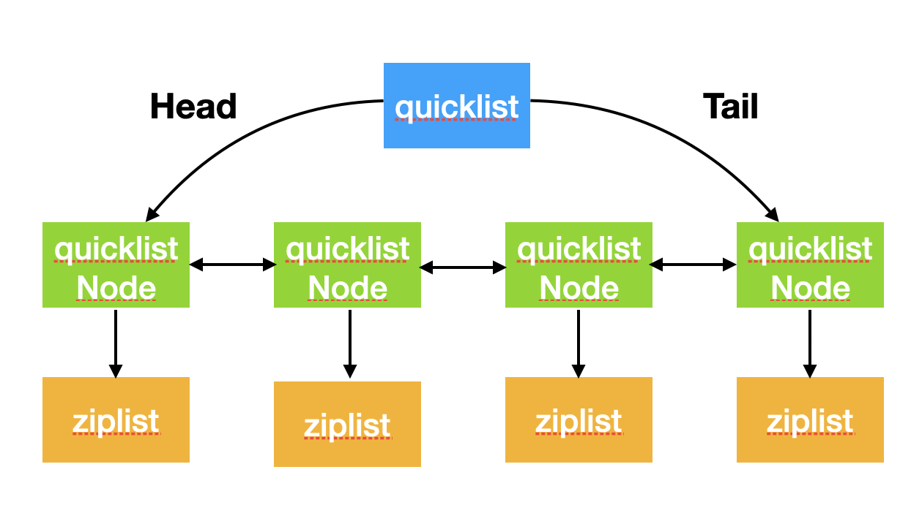

# redis-quicklist

## 简介


quicklist是3.2版本之后引入的用以代替普通的双向链表，主要用于减少拥有大量节点的链表的内存使用。
基于ziplist的扩展list，平衡了内存连续性和随机插入删除问题
支持对中间节点做压缩，依据是list通常只对表头表尾做操作而不是中间节点


## 原理
### 数据结构
quikclist数据结构如下
```c
#define QUICKLIST_NOCOMPRESS 0
static const size_t optimization_level[] = {4096, 8192, 16384, 32768, 65536}; // fill对应的大小限制，-1，-2，-4，-8，-16

typedef struct quicklist {
    quicklistNode *head;
    quicklistNode *tail;
    unsigned long count;        /* 所有ziplist中节点总数 */
    unsigned long len;          /* 所有的quickliseNode数量*/
    int fill : 16;    /* 每个 quicklistNodes上ziplist的大小限制 */
    unsigned int compress : 16; /* 0表示不进行压缩；否则表示表的头和尾不压缩节点的个数 */
    unsigned int bookmark_count: 4;
    quicklistBookmark bookmarks[]; // realloc使用，不使用时不占内存
} quicklist;
```
fill与compress字段是通过选项 list-max-ziplist-size 和 list-compress-depth(默认0) 来设置的。redis内部创建的链表对象都会使用quicklist保存。


其中node结构如下
```c
#define QUICKLIST_NODE_ENCODING_RAW 1
#define QUICKLIST_NODE_ENCODING_LZF 2


typedef struct quicklistNode {
    struct quicklistNode *prev; // 前节点指针
    struct quicklistNode *next; // 后节点指针
    unsigned char *zl;          // 当节点保存的是压缩ziplist时，指向quicklistLZF，否则指向ziplist
    unsigned int sz;             /* ziplist字节数 */
    unsigned int count : 16;     /* ziplist元素数 */
    unsigned int encoding : 2;   /* RAW==1 or LZF==2 */
    unsigned int container : 2;  /* NONE==1 or ZIPLIST==2 */
    unsigned int recompress : 1; /* 此节点之前是否压缩过 */
    unsigned int attempted_compress : 1; /* 节点太小不压缩 */
    unsigned int extra : 10; /* 保留字段 */
} quicklistNode;
typedef struct quicklistLZF {
    unsigned int sz; /* 压缩后大小*/
    char compressed[]; // 压缩后实际内容
} quicklistLZF;
```

quicklistNode是一个32字节的结构体(64位系统下)，使用了位域来让结构保持在32字节。
- zl：如果当前节点的数据没有被压缩，直接指向ziplist；否则指向一个quicklistLZF
- sz：指向ziplist总大小(zlbytes...zlend)压缩前大小
- count：16位，最大65536，由于ziplist每个entry最小为2字节，所以这个值实际上小于32K
- encoding： 2位，RAW=1，LZF=2表示是否被压缩(LZF为压缩算法)
- container：预留字段，指quicklist节点是否用来作为其他结构的容器，实现中一直为2，表示做ziplist的容器。
- recompress：当使用lindex这类命令查看一个压缩过的数据时，会暂时解压，并将recompress置为1，当有机会时会重新压缩。
- attempted_compress：redis自动化测试程序用的
- extra：目前没用

### API
创建比较简单，分配空间然后将各个结构体初始化为零值。
```c
// 创建新的quicklist
quicklist *quicklistCreate(void) 

// 创建新的quicklistNode
REDIS_STATIC quicklistNode *quicklistCreateNode(void)
```

释放时需要遍历所有的节点依次释放其指向的zl，最后释放quicklist结构体。
```c
void quicklistRelease(quicklist *quicklist)
```

关于压缩与解压部分就不写了，比较简单，直接拿到zl的指针进行压缩，解压同理，直接使用lzf算法。


```c
int quicklistPushHead(quicklist *quicklist, void *value, size_t sz) {
    quicklistNode *orig_head = quicklist->head;
    if (likely(
            _quicklistNodeAllowInsert(quicklist->head, quicklist->fill, sz))) {
        quicklist->head->zl =
            ziplistPush(quicklist->head->zl, value, sz, ZIPLIST_HEAD);
        quicklistNodeUpdateSz(quicklist->head);
    } else {
        quicklistNode *node = quicklistCreateNode();
        node->zl = ziplistPush(ziplistNew(), value, sz, ZIPLIST_HEAD);

        quicklistNodeUpdateSz(node);
        _quicklistInsertNodeBefore(quicklist, quicklist->head, node);
    }
    quicklist->count++;
    quicklist->head->count++;
    return (orig_head != quicklist->head);
}
```
pushhead函数会将value指向的size长度的值插入到链表的头部，因为quicklist是作为ziplist的容器，所以插入过程分两部分，第一种情况为直接在头部的ziplist插入到头节点位置，如果创建新节点返回1否则返回0，并通过likely优化跳转指令来加速。

```c
REDIS_STATIC int _quicklistNodeAllowInsert(const quicklistNode *node,const int fill, const size_t sz)
```
_quicklistNodeAllowInsert函数会判断当前节点是否可以插入，首先根据要插入的大小判断ziplist节点所需要的头部大小计算插入会增加的size，然后根据quicklist中fill的数值(由配置得来)限定当前节点的大小来决定是是否可以插入。如果判断可以插入将调用头节点指向的ziplist插入数据。

如果上面判断失败，将会新建一个quicklistNode，并新建一个ziplist保存到对应的node->zl中。

```c
int quicklistPushTail(quicklist *quicklist, void *value, size_t sz)
```
在尾部插入节点与头部插入同理。

```c
#define AL_START_HEAD 0
#define AL_START_TAIL 1

typedef struct quicklistIter {
    const quicklist *quicklist;
    quicklistNode *current;
    unsigned char *zi;
    long offset; /* offset in current ziplist */
    int direction;
} quicklistIter;

quicklistIter *quicklistGetIterator(const quicklist *quicklist, int direction);
```
迭代器可以调用quicklistNext对quicklist进行迭代，迭代过程中不能进行插入但是可以使用quicklistDelEntry删除元素。

### quicklistNode分裂与合并
在quicklist中间某一节点插入数据的过程中，会出现当前节点已满无法插入，此时必须进行分裂，分裂后插入的数据为当前节点的末尾，后面的数据产生新的节点。

插入后为了防止分裂使quicklist碎片化，会调用_quicklistMergeNodes进行合并，以分裂的前一个节点为中心节点进行合并。
 - (center->prev->prev, center->prev)
 - (center->next, center->next->next)
 - (center->prev, center)
 - (center, center->next)

 合并之前同样是检查容量是否满足，满足则进行合并。

 ## 总结

- quicklist 不会对过小的 ziplist 进行压缩，这个值为 MIN_COMPRESS_BYTES，目前是 48
- quicklist 在对 ziplist 进行压缩后，会对比压缩后的长度和未压缩的长度，若压缩后的长度 - 未压缩的长度 < 8（MIN_COMPRESS_IMPROVE），则使用未压缩的数据
- quicklist 的头节点和尾节点在任何时候都不会被压缩，因此可以保证将数据插入列表的头或者尾是高效的。
- 插入一个数据到压缩的节点时，需要先对节点的 ziplist 整个进行解压，插入后再次进行压缩，所以默认采用不压缩速度会比较快
- 对中间已满节点进行插入是会导致分裂，分裂点即为插入点，分裂完成后插入的数据成为当前节点的尾部，其他的产生新节点，并进行合并减少碎片。
- 迭代器可以调用quicklistNext对quicklist进行迭代，迭代过程中不能进行插入但是可以使用quicklistDelEntry删除元素。