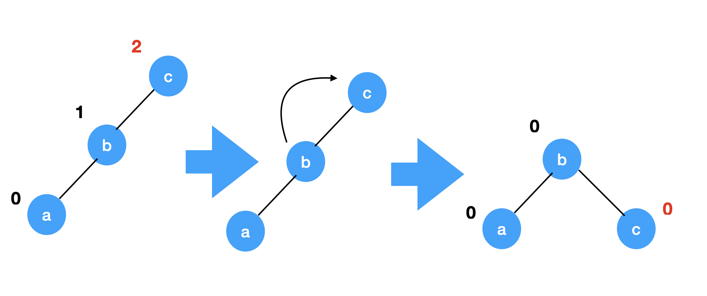
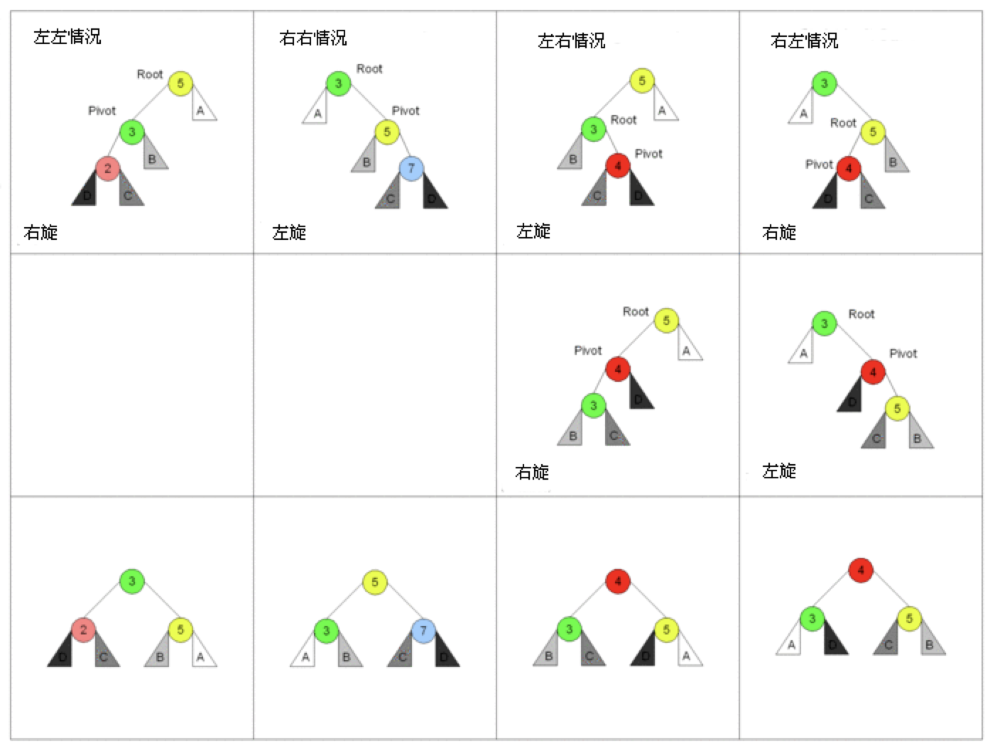

# AVL树
avl是一棵自平衡二叉树，任意节点两子树高度差距超过1时则会自动进行平衡，所以保证了插入、删除、查找的平均和最坏情况下的时间复杂度都是O(log(n))。

增加和删除元素的操作需要进行一次或多次树的旋转是娴熟的重新平衡。树中的每一个节点又一个平衡因子，为它的左子树高度减去又子树高度(有时是相反的)。平衡因子为1、0、-1的节点认为是平衡的，-2、2为不平衡节点，需要进行调整，平衡因子可以直接存储到节点中，也可以通过树高度进行计算。

其中的核心就是树的自平衡，也就是旋转操作，仅记录此部分。

旋转操作主要分为两部分，左旋与右旋

右旋的状况反过来就行。

avl树中一共有四种需要平衡的情况
- 左子树高于右子树
- 右子树高于左子树
- 在左子树的右子树插入导致不平衡
- 在右子树的左子树插入导致不平衡

来一张wiki的图，上面为四种状态，经过变换得到最下面的状态。


实现起来比较简单
```go
func (t *AVLTreeNode)leftRotation()*AVLTreeNode{
    node:=t.right
    t.right=node.left // 父节点接替右子节点的左子节点
    node.left=t
    t.hight=getMax(t.left.getNodeHigh(),t.right.getNodeHigh())+1
    node.high=getMax(node.left.getNodeHigh(),node.right.getNodeHigh())+1
    return node
}

// 左旋反过来而已
func (t *AVLTreeNode)rightRotation()*AVLTreeNode{
    node:=t.left
    t.right=node.right // 父节点接替左子节点的右子节点
    node.right=t
    t.hight=getMax(t.left.getNodeHigh(),t.right.getNodeHigh())+1
    node.high=getMax(node.left.getNodeHigh(),node.right.getNodeHigh())+1
    return node
}
// 先让左子节点左旋之后，本节点右旋
func (t *AVLTreeNode) leftRightRotation() *AVLTreeNode {
    t.left = t.left.leftRotation()
    return t.rightRotation()
}
// 先让右子节点右旋之后，本节点左旋
func (t *AVLTreeNode) rightLeftRotation() *AVLTreeNode {
    t.right = t.right.rightRotation()
    return t.leftRotation()
}
```
avl对于有序元素顺序插入时会频繁的旋转性能下降。