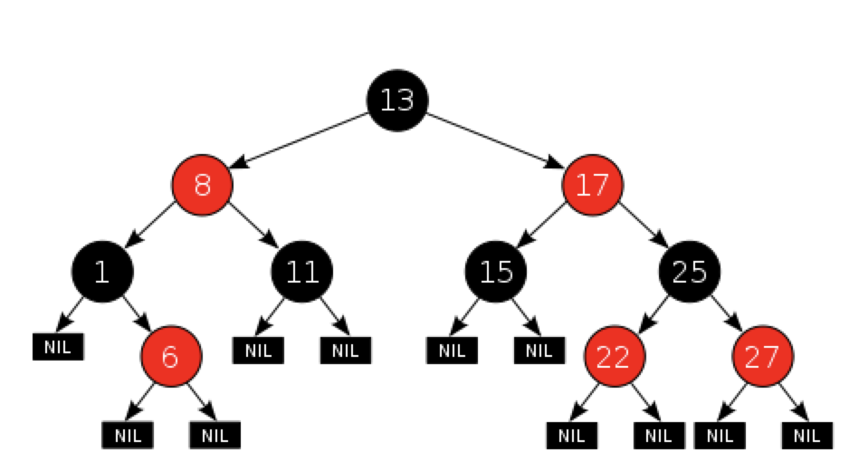
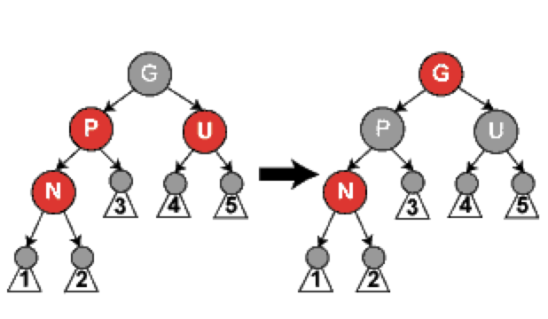
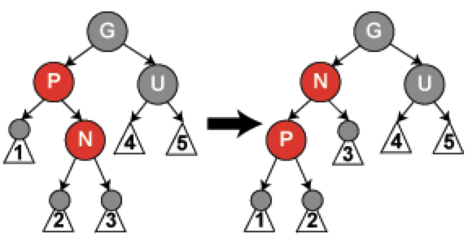
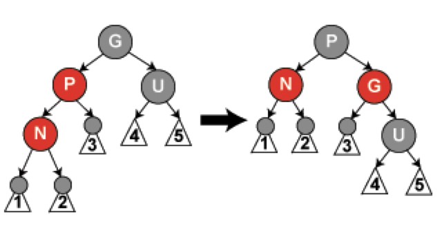
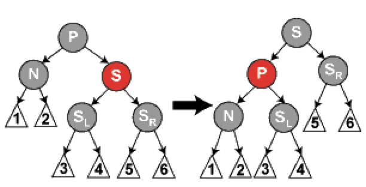
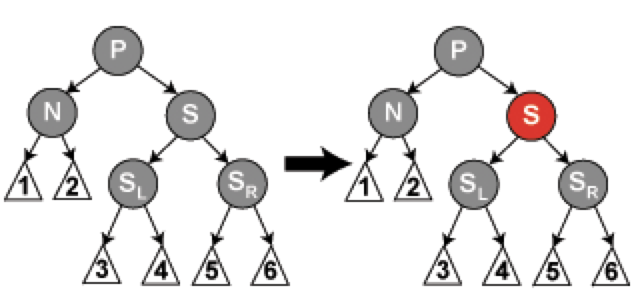
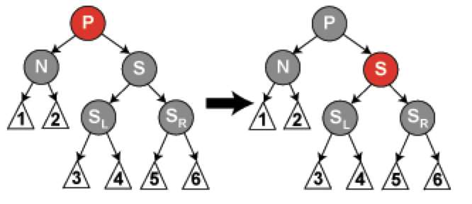
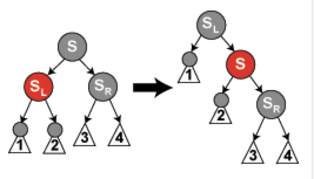
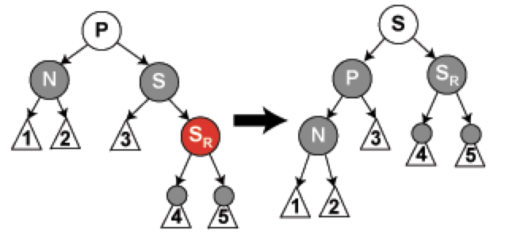

# 红黑树
红黑树知识点归档，虽然不知道这东西有啥难的，但是为了防止自己记不住。

红黑树的结构复杂，但它的操作有着良好的最坏情况运行时间，并且在实践中高效：它可以在O(log n)时间内完成查找、插入和删除，这里的n是树中元素的数目。

## 定义
节点只有红与黑两种状态的自平衡二叉查找树，性质
- 节点只有红与黑两种状态
- 根节点为黑色
- 叶子节点为黑色(叶子节点为空nil)
- 红节点必须有两个黑色子节点(所以红节点不连续)
- 任意节点到其叶子节点的路径都包含相同数量的黑节点

图来自wiki


这些约束确保了红黑树的关键特性：从根到叶子的最长的可能路径不多于最短的可能路径的两倍长。结果是这个树大致上是平衡的。因为操作比如插入、删除和查找某个值的最坏情况时间都要求与树的高度成比例，这个在高度上的理论上限允许红黑树在最坏情况下都是高效的，而不同于普通的二叉查找树。

性质4保证路径上不会有两个相邻的红节点，因此最短路径可能全黑，最长路径可能是红黑交替的，根据性质5所有最长路径黑节点数目相同，因此不会超过2倍。

上图中子节点标注nil表示不保存数据，只是标记结束。

## 插入过程
插入时按照二叉查找树进行插入，新节点标记为红色(为啥不搞成黑色的，黑色会违反性质5，比较难搞，但是搞成红色的，就可以通过变色与旋转来调整)。具体咋调整取决于临近节点的颜色。

父节点的兄弟，定义成叔父节点。

注意：
- 性质1与3总是保持(这铁定不会变的)
- 性质4只在增加红节点、重绘黑节点为红色、或旋转时可能冲突
- 性质5只在增加黑节点(这个不现实)、重绘红节点为黑色、或旋转时可能冲突


搞起

先来个找叔叔的函数，要找叔叔，得先知道爷爷是谁
```c
 node* grandparent(node *n){
     return n->parent->parent;
 }

 node* uncle(node *n){
     if(n->parent == grandparent(n)->left)
         return grandparent (n)->right;
     else
         return grandparent (n)->left;
 }
```

下面开始插入，将要插入的节点标为N，N的父节点标为P，N的祖父节点标为G，N的叔父节点标为U。在图中展示的任何颜色要么是由它所处情形这些所作的假定，要么是假定所暗含的。

分情况讨论

情况1:新节点N位于树根，没有父节点
这种情况，很明显违背了性质2，给他改成黑的，诶嘿满足了，同时也不会影响性质5

```c
 void insert_case1(node *n){
     if(n->parent == NULL)
         n->color = BLACK;
     else
         insert_case2 (n);
 }
```

情况2:新节点的P是黑的，没有违反4(因为加进来个红的)，也没影响5，尽管N有俩黑子节点，但是它自己是红的啊，所以没任何影响，那就不动了。

```c
 void insert_case2(node *n){
     if(n->parent->color == BLACK)
         return; /* 树仍旧有效*/
     else
         insert_case3 (n);
 }
```

    注意：看到这个if是判断p是不是黑的了，所以一旦走了else，n一定有爷爷，因为p是红的了，不可能是根节点。那它一定有叔叔，虽然可能是叶子节点。

情况3:如果P(一定是红的)跟U都是红的，(不管N是P的左子节点还是右子节点都一样)，那我们可以把它的P与U都改成黑的并把G改成红的(保持性质5)。因为通过P和U的路线一定经过G，因此黑节点数目没变。但是G可能是跟节点，这就违反了2了，也有可能G的父节点是红的，这就违反了4了。这咋办？有没有发现此时的G有点眼熟，这不是情况1下的N吗？那直接对G进行情况1的处理就好了啊。

这个情况下U必须要有，而且必须是红的

来个图，N作为左子节点，同样来自wiki



```c
 void insert_case3(node *n){
     if(uncle(n) != NULL && uncle (n)->color == RED) {
         n->parent->color = BLACK;
         uncle (n)->color = BLACK;
         grandparent (n)->color = RED;
         insert_case1(grandparent(n));
     } else
         insert_case4 (n);
 }
```

    注意：接下来我们假设P为G的左子节点，如果是右边的左右换一下就行

情况4:P是红的，U没了或者是黑色(上面的else)，且N为P的右子节点，不看颜色的情况下这不就是AVL的LR情况吗，那就先左旋。


下面我们需要按照情况5来处理以前的P来解决失效条件4。这个转换会导致某些路径通过它们以前不通过的新节点N(比如图中1)或不通过节点P(比如3)，虽然俩都是红的，但是不影响5啊(狗血)。

```c
 void insert_case4(node *n){
     if(n == n->parent->right && n->parent == grandparent(n)->left) {
         rotate_left(n);
         n = n->left;
     } else if(n == n->parent->left && n->parent == grandparent(n)->right) {
         // 对称的
         rotate_right(n);
         n = n->right;
     }
     insert_case5 (n);
 }
```

情况5:父节点是红的，U为黑的或者没有，新节点N为P的左子节点，不看颜色就是AVL的LL情况，那么直接右旋。


旋转后，之前的P成为了N与G的父节点，因为以前G是黑的，所以我们把P换成黑的，G给换成红的，满足了4也满足了5。

```c
 void insert_case5(node *n){
     n->parent->color = BLACK;
     grandparent (n)->color = RED;
     if(n == n->parent->left && n->parent == grandparent(n)->left) {
         rotate_right(n->parent);
     } else {
         // 这就对应情况4中的else
         rotate_left(n->parent);
     }
 }
```
插入完成了


## 删除过程
删除有两个儿子的节点，可以转化为删除另一个只有一个儿子的节点(儿子为非叶子节点)。二叉查找树中删除非叶子节点，要么是移动到左子树中最大值的位置，要么是移动到右子树中最小值的位置(因此移动后待删除节点最多只能有一个儿子)。简化为如何删除最多又一个儿子节点的问题。

    注意：替换时只修改了值并不会修改节点颜色。

如果我们要删除一个红色节点(此时该节点的儿子都为叶子节点)，它的父亲与儿子一定是黑的。这时用儿子来填充它就可以，不会破坏3和4，因为少了一个红节点也不会破坏5。另一种情况，如果待删除节点为黑色，儿子为红色时，需要把儿子改成黑色来替代它以保持5。

当要删除的节点与它的儿子都是黑色时，不能直接删除，不然一边的路径长度比另一边会大1，违反了5。首先，将待删除节点替换为它的儿子，这个儿子为N，N的兄弟为S，P为N的父亲，Sl为S的左儿子，Sr为S的右儿子。

找兄弟的函数
```c
struct node *
sibling(struct node *n)
{
        if(n == n->parent->left)
                return n->parent->right;
        else
                return n->parent->left;
}
```

上面简单的删除情况代码,replace函数用来替换child到n在树中的位置。
```c
void delete_one_child(struct node *n)
{
        struct node *child = is_leaf(n->right)? n->left : n->right;
 
        replace_node(n, child);
        if(n->color == BLACK){
                if(child->color == RED)
                        child->color = BLACK;
                else
                        delete_case1 (child);
        }
        free (n);
}
```

如果N和它的初始父亲是黑色，则删除父亲会导致少一个黑节点，因此需要重新平衡。

情况1:N是新的跟，如果它是新的根那不会违反任何性质。
```c
void delete_case1(struct node *n)
{
        if(n->parent != NULL)
                delete_case2 (n);
}
```

    注意：在情况2、5和6下，嘉定N是它父亲的左儿子，右儿子同理。

情况2:S是红色，这种情况下要在N的父亲左左旋，把红色的兄弟变为N的爷爷，对调N的父亲和爷爷的颜色，改变之后，所有路径上的黑节点数目并没有改变，但是N有了个一个黑色的兄弟与红色的父亲，所以可以按照情况4、5、6来处理。


    注意：为啥发生旋转了呢？因为这是发生在删除过程中的，其实删除的是P与N中间的节点，不然怎么会发生。

```c
void delete_case2(struct node *n)
{
        struct node *s = sibling (n);
 
        if(s->color == RED){
                n->parent->color = RED;
                s->color = BLACK;
                if(n == n->parent->left)
                        rotate_left(n->parent);
                else
                        rotate_right(n->parent);
        } 
        delete_case3 (n);
}
```

情况3:N的父亲、S和S的儿子都是黑色，这种情况下我们需要重绘S为红色，结果通过S的路径少了一个黑节点，因此删除N的初始父亲，使通过N的路径也少一个黑节点，但是通过P的所有路径比不通过P的少了一个黑节点，因此我们需要对P进行从情况1开始的处理。


```c
void delete_case3(struct node *n)
{
        struct node *s = sibling (n);
 
        if((n->parent->color == BLACK)&&
(s->color == BLACK)&&
(s->left->color == BLACK)&&
(s->right->color == BLACK)) {
                s->color = RED;
                delete_case1(n->parent);
        } else
                delete_case4 (n);
}
```

情况4:S和S的儿子都是黑色，但是N的父亲是红色，这种情况下我们交换N的父亲和兄弟的颜色，这不影响不通过N的路径中黑节点数目，但通过N的路径上黑节点数目+1补上了刚才删掉的黑节点。


```c
void delete_case4(struct node *n)
{
        struct node *s = sibling (n);
 
        if（(n->parent->color == RED)&&
(s->color == BLACK)&&
(s->left->color == BLACK)&&
(s->right->color == BLACK)) {
                s->color = RED;
                n->parent->color = BLACK;
        } else
                delete_case5 (n);
}
```

情况5:S是黑色，S的左儿子是红色，S的右儿子是黑色，N为S父亲的左儿子，因此需要右旋

这样，S的左儿子成为了S的父亲和N的新兄弟，接下来交换S与新父亲的颜色，所有路径仍有相同数目的黑节点，但N有了一个黑兄弟，并且它的右儿子为红色，因此进入情况6。

```c
void
delete_case5(struct node *n)
{
        struct node *s = sibling (n);
 
        if（s->color == BLACK){ /* this if statement is trivial, 
due to Case 2(even though Case two changed the sibling to a sibling's child, 
the sibling's child can't be red, since no red parent can have a red child). */
// the following statements just force the red to be on the left of the left of the parent, 
// or right of the right, so case six will rotate correctly.
                if((n == n->parent->left)&&
(s->right->color == BLACK)&&
(s->left->color == RED)) { // this last test is trivial too due to cases 2-4.
                        s->color = RED;
                        s->left->color = BLACK;
                        rotate_right (s);
                } else if((n == n->parent->right)&&
(s->left->color == BLACK)&&
(s->right->color == RED)) {// this last test is trivial too due to cases 2-4.
                        s->color = RED;
                        s->right->color = BLACK;
                        rotate_left (s);
                }
        }
        delete_case6 (n);
}
```

情况6:S是黑色，S的右儿子是红色，N是它父亲的左儿子。这种情况下我们对N的父亲左旋，这样S成为了N的父亲(P)和S的右儿子的父亲，接着交换N的父亲与S的颜色，并使S的右儿子为黑色。



子树在跟节点上仍是相同的颜色，所以符合3的要求，但是N多了个黑色祖先：要么N的父亲变成黑色，要么它是黑色而S被增加为一个黑色祖父，因此通过N的路径增加了一个黑色节点。

此时不通过N的路径有两种可能：
- 它通过N的新兄弟，那么它以前和现在都必定通过S和N的父亲，而他们只是交换了颜色，所以保持了相同数目的黑色节点。
- 它通过N的新叔叔，S的右儿子，那么它以前通过S，S的父亲和S的右儿子，但现在只通过S，它被假定为它以前的父亲的颜色，和S的右儿子，他被从红改为黑。合成效果为，这个路径通过了相同数目的黑节点。

任何情况下，黑节点数目都没变，途中白色节点可为黑也可为红，但是变换前后颜色必须是一样的。

```c
void delete_case6(struct node *n)
{
        struct node *s = sibling (n);
 
        s->color = n->parent->color;
        n->parent->color = BLACK;
 
        if(n == n->parent->left){
                s->right->color = BLACK;
                rotate_left(n->parent);
        } else {
                s->left->color = BLACK;
                rotate_right(n->parent);
        }
}
```